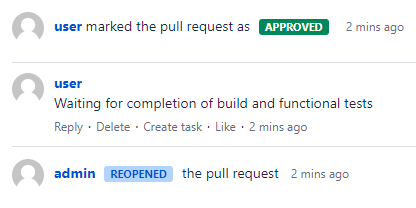
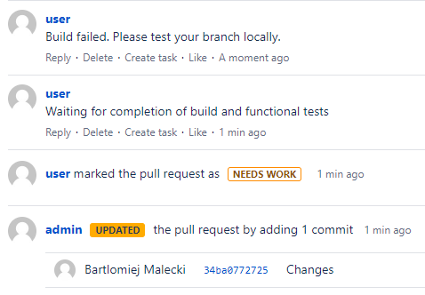

# Bitbucket Webhook for Jenkins

## How it works?
This webhook implementation blocking the pull request merge until successful Jenkins job build.
It uses some BitBucket service user that changes PR status to 'NEEDS WORK' immediately
after openig pull request or updating approved pull request.

Example:
- Aproved after successful build



- Reject after failed build



## Webhook Configuration
1. Build project
```
go build
```
2. Deploy binary and run
```
export BITBUCKET_USER="user"
export BITBUCKET_PASSWORD="passoword"
export BITBUCKET_URL="http://bitbucket.example.com"
export JENKINS_USER="user"
export JENKINS_TOKEN="token_from_jenkins"
export JENKINS_URL="http://jenkins.example.com"
./bitbucketToJenkinsWebhook
```

## Jenkins Configuration 
1. Generate token for user in order to trigger builds remotely (e.g., from scripts) 
```
Dashboard -> <User> -> Configure -> API Token
```
e.g.
```
curl -u admin:11cef4962f699ef4e4d4f9093e63445a2e -XPOST http://localhost:8080/job/test/build
```
2. Create new Jenkins' pipeline
3. Use `webhook.Jenkinsfile` for this pipeline. Configure all necessary variables.
4. Configure your build stage.


## BitBucket Configuration 

1. Add Webhook on BitBucket repository
  - Go to repository settings
  - Select 'Webhooks'
  - Click 'Create Webhook'
  - Configure webhook url
  - Check 'Push' and 'Opened' events
2. Configure repository policy
  - Go to repository settings
  - Select 'Merge checks'
  - Enable "No 'needs work' status"


## Helpful links
https://docs.atlassian.com/bitbucket-server/rest/6.10.0/bitbucket-rest.html


## Helpful commands
```
go run main.go

go test -run TestWebhookOpenPR

docker run -v bitbucketVolume:/var/atlassian/application-data/bitbucket --name="bitbucket" --rm -p 7990:7990 -p 7999:7999 atlassian/bitbucket-server:6.10

docker run -p 8080:8080 -p 50000:50000 -v jenkins_home:/var/jenkins_home jenkins/jenkins:lts

curl -u user:user  http://localhost:7990/rest/api/1.0/projects/TEST/repos/example/pull-requests?state=OPEN

curl -v -u user:user  -H "Content-Type: application/json" \
--data '{"text": "An insightful general comment on a pull request."}' \
http://localhost:7990/rest/api/1.0/projects/TEST/repos/example/pull-requests/2/comments

curl -v -u user:user -XPUT -H "Content-Type: application/json" \
--data '{"status": "NEEDS_WORK"}' \
http://localhost:7990/rest/api/1.0/projects/TEST/repos/Example/pull-requests/2/participants/user

curl -v -u user:user -XPUT -H "Content-Type: application/json" \
--data '{"status": "APPROVED"}' \
http://localhost:7990/rest/api/1.0/projects/TEST/repos/Example/pull-requests/2/participants/user

curl -u user:user -XPOST -H "Content-Type: application/json" \
http://localhost:7990/rest/api/1.0/projects/TEST/repos/example/pull-requests/2/approve

```

## To Do
1. Secure the webhook using BitBuckets secret